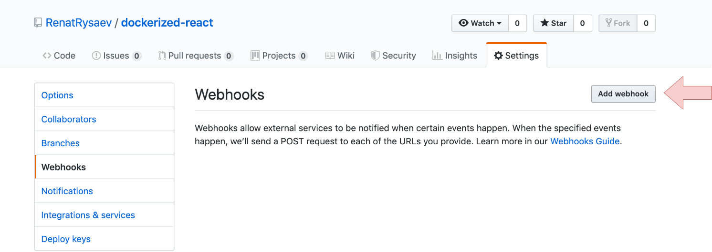
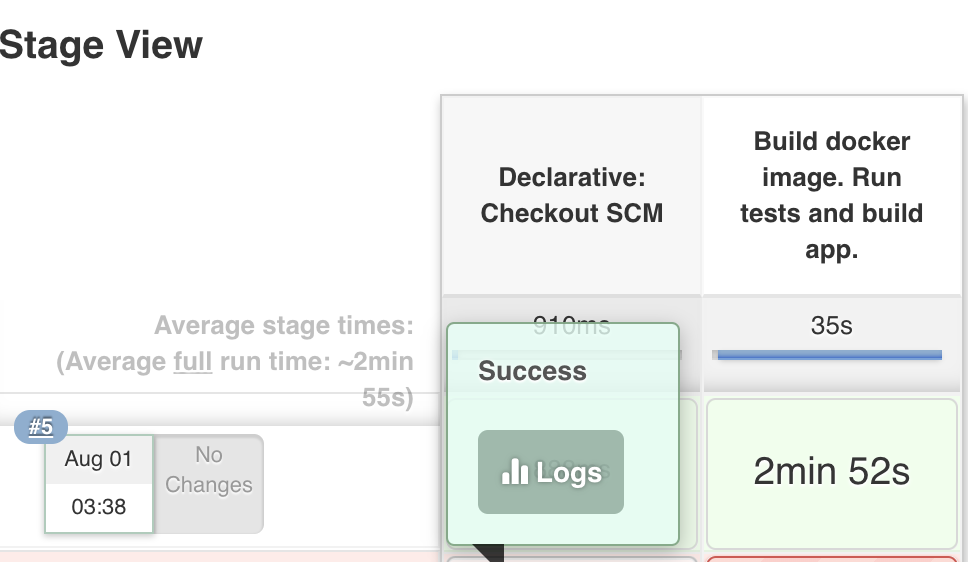

###Это третья часть, в которой мы постараемся разобраться с тем, как сделать простейший CI с помощью Jenkins.

В <b>[прошлой части](https://rysaev.dev/react-ci-cd-2/)</b> мы написали два Dockerfile для CI/CD.
Сегодня мы рассмотрим как можно организовать простейший CI для нашего React-приложения.  

> [Репозиторий с итоговым кодом](https://github.com/RenatRysaev/dockerized-react/tree/react-ci-cd-3) для этой статьи

Препологается, что у вас уже есть vps сервер с установленным linux и статическим ip(либо доменом),
а так же доступ по ssh.  
В качестве ОС я использовал ubuntu 18.04  
Ниже представлен список статей, с помощью которых я осуществил первоначальную настройку
и установил Jenkins на мой сервер.

1) [Первоначальная настройка ubuntu (RU)](https://www.digitalocean.com/community/tutorials/ubuntu-18-04-ru)
2) [Установка Jenkins (EN)](https://linuxize.com/post/how-to-install-jenkins-on-ubuntu-18-04/)
3) [Установка Docker (RU)](https://www.digitalocean.com/community/tutorials/docker-ubuntu-18-04-1-ru)

###Введение 
Для начала давайте разберемся, как будет построен процесс.  

1) Пушим коммит в репозиторий.
2) С помощью webhooks github будет оповещать Jenkins о том, что произошел пуш.
3) Jenkins запускает Job, который подписан на это событие.
4) Job запускает jenkins-pipeline, который собирает образ и при сборке запускает тесты.

Давайте попробуем визуализировать все этапы этого процесса.


###Давайте сделаем так, чтобы github оповещал Jenkins при событии пуша

<b>Чтобы добавить webhook перейдите в репозиторий -> settings -> webhooks</b>


<b>Настроим webhook</b>

Разберем пошагово:
1) Payload URL - это тот URL куда github будет слать POST-запрос при событии пуша.
Имеет вид: http://jenkins-domain/github-webhook/
К примеру: http://105.196.135.40:8080/github-webhook/
2) Указываем тип данных в запросе
3) Указываем триггер срабатывания webhook
4) Добавляем webhook

<b>Добавленный webhook будет выглядеть следующим образом:</b>


Теперь когда мы запушим коммит в репозиторий, github будет слать POST-запрос по указанному URL,
что в свою очередь должно тригернуть нашу будущую Job.


###Создание Job с jenkins-pipeline

Jenkins-pipeline - это тип задач в Jenkins, с помощью которого мы можем пошагово описать
необходимый процесс сборки, тестирования, деплоя и тд.
Описывать pipeline мы будем в файле, который будет храниться в репозитории.

Сначала создадим задачу, а затем опишем pipeline.

<b>Создаем задачу:</b>


<b>Необходимо задать имя и тип задачи:</b>


<b>Укажем что триггером запуска задачи будет событие пуша в репозиторий:</b>


<b>Укажем откуда брать pipeline:</b>


<b>Пошагово разберемся:</b>
1) Говорим Jenkins, что pipeline находится в репозитории
2) Указываем Git в качестве системы контроля версий
3) Указываем URL репозитория(здесь должен быть URL вашего репозитория)
4) Указываем ветку, которую нужно собирать при событии пуша.
5) Указываем путь до файла с jenkins-pipeline (от корня приложения)
6) Жмем "Save"

###Описываем pipeline

В корне проекта создадим файл <b>jenkins.ci</b> со следующим содержанием:

```Jenkinsfile
pipeline {
    agent any

    stages {
        stage('Build docker image. Run tests and build app.') {
            steps {
                git 'https://github.com/RenatRysaev/dockerized-react'
                sh 'sudo docker build -t dockerized-react:test -f Dockerfile.test .'
            }
        }
    }
}
```

Именно за этим файлом Jenkins будет ходить, чтобы получить описание pipeline.
Не будем заострять внимание, потому что pipeline достаточно декларативен.  

Вкратце: клонируется репозиторий и выполняется команда сборки контейнера,
в котором у нас запускаются тесты и собирается приложение.  

Если упадут тесты или не соберется приложение, то задача будет считаться неудачной.

<b>Давайте попробуем вручную запустить нашу Job:</b>


<b>Если вы столкнулись с ошибкой "sudo: no tty present and no askpass program specified",
то вам нужно сделать следующее:</b>

```bash
sudo visudo
```

А затем добавить в файле в секцию "# Allow members of group sudo to execute any command" следующее:
```
jenkins ALL=(ALL) NOPASSWD: ALL
```

Обсуждение этой проблемы на [stackoverflow](https://stackoverflow.com/questions/37603621/jenkins-sudo-no-tty-present-and-no-askpass-program-specified-with-nopasswd)

<b>Если вы все сделали правильно, то увидите примерно следующее:</b>


Готово, теперь можете протестировать как работает ваш CI, сделав пуш в репозиторий.

Обычно в CI еще добавляют разные механизмы для того, чтобы узнать как прошла сборка.
Это может быть сообщение в мессенджер со статусом, или примитивный статус в README,
а может быть и то и другое.

Если вы хотите прикрутить что-то подобное, то можно начать с [этого](https://www.youtube.com/watch?v=clQEdNdOBm0).

В следующей финальной части мы разберемся с CD(Continuous Delivery).
